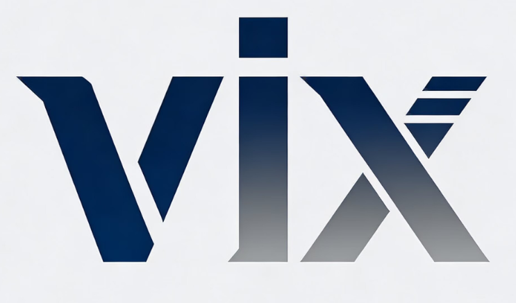

# Vix 编程语言详细介绍

Vix是一种轻量级的编译型脚本语言，旨在提供接近原生 C++ 的执行速度，同时保持脚本语言的简洁性和易用性。

## Why Vix?

### 核心特点

- **轻量级设计**：语言本身精简，易于学习和使用
- **多后端支持**：编译为cpp,qbe ir,llvm ir等 
- **静态类型**：类型检查严格，避免运行时错误
- **多平台支持**：支持Windows,Linux,MacOS等平台
## 快速开始
1. 安装依赖
```shell
apt install gcc g++ flex bison ## ubuntu
yum install gcc gcc-c++ flex bison ## centos
brew install flex bison ## macos
pacman -S flex bison g++ gcc ## archlinux
```

### 编译
```shell
make
```

### 运行
```shell
vixc -v
```

```shell
vixc hello.vix -o hello
```
- 完整命令在doc中

License: MIT
